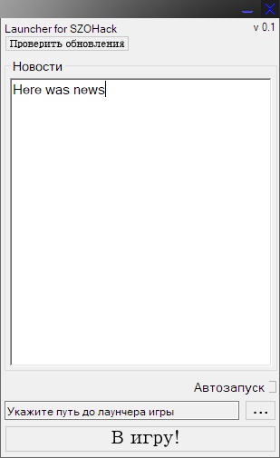

# SZOH Launcher

    

Here is archived source code for on of my first programming project.
Its a launcher for [SZOHack](https://github.com/IgorKhramtsov/SZOHack-v3).

## Functions
- Verifying computer time for securing cheat linking
- Updating cheat and self version
- Injecting dll into the game
- Ability to autorun with system 
- Hiding in tray
- Gathering news from site

Almost all functions doesnt work now. Code is also changed a little to make it runnable.